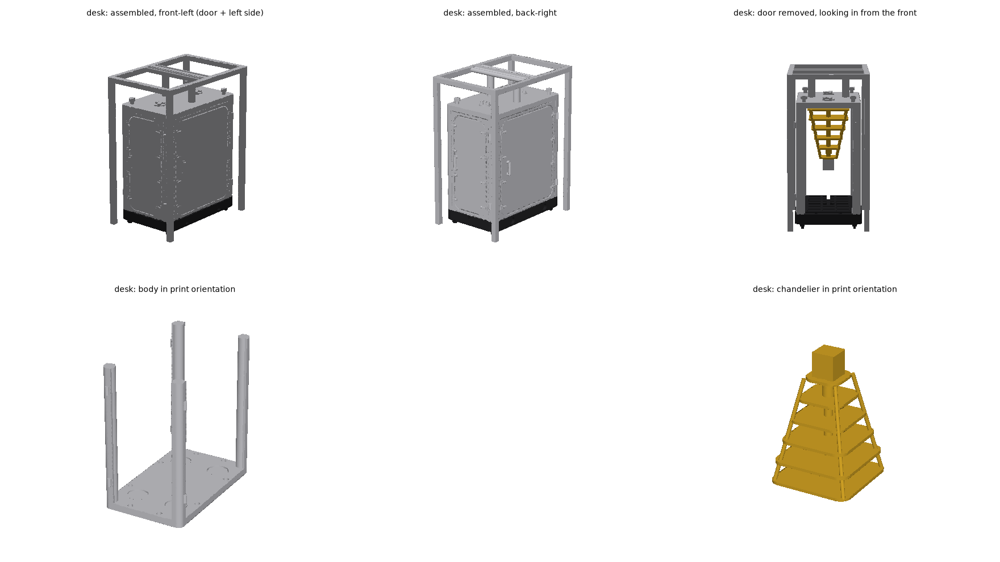
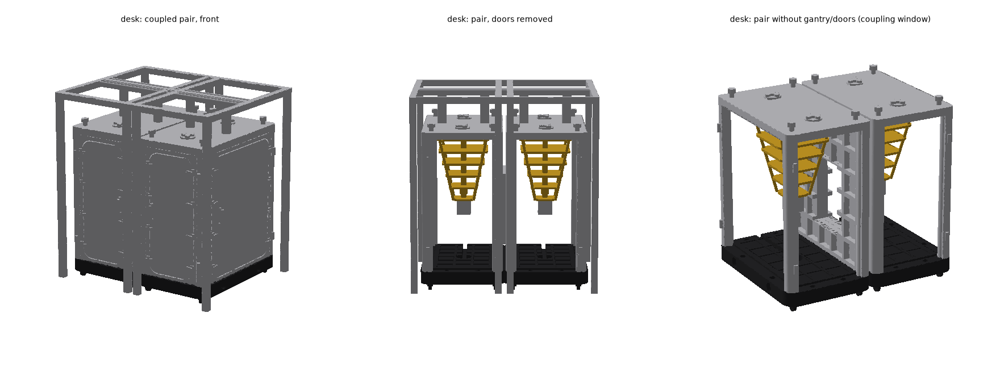

# Union — IBM modular cryogenic cell (parametric model)

A desk-top miniature of one cell of IBM's **Modular Quantum Cryogenic
Architecture** (announced 2026-08-19, photo-asset name "Union"): the
box-shaped aluminium "fridge" with pocketed doors that replaces the cylindrical
cryostat, designed to be coupled side-by-side into larger systems.

The model is a **self-contained cell** with **four removable doors** (as on
the real cell: every face is a door); print two (or more) cells and they
couple side-by-side with magnets in the plinth — the same "clunk" that joins
the RTE servers to the RasQberry cryostat.



Sources, provenance and the deliberate deviations from IBM's material are
listed in [sources.md](sources.md). This is the first model built with the
code-CAD approach described in [../README.md](../README.md); the lessons
learned are in the "Building a NEW model" section there.

## Presets

One script, two scales. All numbers come from the real cell in metres
(`REAL` in `union_model.py`) times the preset scale; feature sizes are then
clamped to what a 0.4 mm nozzle can print.

| | `desk` | `showpiece` |
|---|---|---|
| scale | 1:23.5 (body height **93.3 mm** = every existing RasQberry body) | 1:15 |
| cell W × D × H (mm) | 46.7 × 76.4 × 93.3 | 73.3 × 120.0 × 146.5 |
| plinth W × D (mm) | 48.8 × 78.6, 7.2 thick, 4.2 mm casters | 76.7 × 123.3, 11.3 thick |
| front/back door W × H × T (mm) | 35.6 × 77.6 × 4.85 | 55.7 × 122.1 × 7.33 |
| left/right door W (mm) | 65.3 | 102.5 |
| pockets | 3 × 6 front/back, 5 × 6 sides; 2.9 mm deep, 1.9 mm webs | 4.3 mm deep, 3.0 mm webs |
| fine detail | toggle clamps (4 per door edge), pull handle, hinge barrels — clamped to 0.8 mm sections | same, finer, **plus the video-detail set**: black wavy support blades, two-colour latches + catch plates, stage + two "IBM" cans with wire bails, helical coax, bolt-hole grid on the top plate |
| always on (both scales) | gasket seam on every door, waffle floor, ceiling vents, hex standoff pins + connector clusters, gantry cooling lines | same |
| chandelier plates (mm) | 30.6 → 13.2, pitch 7.5 | 48.0 → 20.7, pitch 11.7 |
| gantry frame (optional part) | 59 × 89 × 114.5 mm, 3.5 mm posts | 93 × 140 × 180 mm |
| filament (solid volume) | body 23 + plinth 29 + doors 2×9 + 2×16 + chandelier 4 + gantry 10 cm³ | ≈ 85 + 112 + 2×35 + 2×60 + 11 + 35 cm³ |

`python3 union_model.py --preset desk|showpiece|all` prints a table of all
derived dimensions and feature toggles.

**Accurate by default:** exteriors are flat brushed aluminium, the square
weight-saving pockets face the *inside* (vacuum space) of every door and
panel — exactly as in the photos and in IBM's explorer. Remove the door and
you look at pocketed walls and the chandelier; the door shows its own pocket
grid on the back. `--pockets-outside` gives the decorative variant.

**Video-detail round (2026-08-24):** a frame-by-frame pass over IBM's
announcement video (YouTube `wwMI6IhvwE0`) added, at both scales, the gasket
seam engraved around every door face (rounded corners, as at 0:12), the
waffle grid on the plinth floor and the round vent recesses in the ceiling
(the tunnel shot at 0:33), four hex-head standoff pins and two connector
clusters on the top plate (0:12 / 0:27), and cooling lines along the gantry
frame (0:37). The showpiece additionally gets the black topology-optimised
wavy blades that carry the chandelier plates (0:07), two-colour toggle
latches with catch plates on the jambs, a machined stage with pillar bank
and spider blocks under the bottom plate, two "IBM" cans with rounded edges,
brackets and wire bails (0:05), a helical coax line between two plates, and
a bolt-hole grid across the top plate — so the showpiece now genuinely is
the "fine detail" preset rather than just a larger print.

## Parts and printing

All parts are exported in print orientation (resting on z = 0), **no
supports needed**. Files: `output/Union_<preset>[<variant>]_<part>.stl / .step / .3mf`.

| Part | Colour | Print orientation | Notes |
|---|---|---|---|
| `body` | silver (Silk Silver like the cryostat) | upside down — top plate on the bed, open bottom up | four posts, top plate, flat door jambs on every post, hinge barrels, ceiling vent recesses; showpiece adds catch plates on the jambs and the bolt-hole grid; with `--doors front` the left/right/back faces become fixed pocketed panels; a `--coupled` side is always a fixed panel with the window; magnet pockets + chandelier hole + pin/cluster holes in the top plate |
| `plinth` | black (Matte Black like the wall) | upside down — top face with the 1 mm registration lip on the bed, casters up | waffle-grid floor, magnet pockets for the door (top face) and for coupling (left/right faces), LED pocket + wire channel |
| `door_front`, `door_back`, `door_left`, `door_right` | silver (+ black latch levers at the showpiece) | flat, outer face (clamps, handle, gasket seam) up — the pocket ceilings are short bridges (≤ 10 mm desk, ≤ 13 mm showpiece); alternatively print it standing on its bottom edge with a brim (no bridges at all, like the original cryostat door) | magnet pockets in the top and bottom edges (horizontal holes when printed flat), gasket groove engraved in the outer face |
| `chandelier` | gold (Silk Gold) + copper details (+ black blades, silver stage/cans, white labels at the showpiece) | upside down — top flange/largest plate on the bed; bridges ≤ 15 mm between the corner supports, no supports | top flange glues to the ceiling, stub locates it |
| `payload` (`--interior payload`) | gold shelves/spine + silver boxes/fin stacks | upright — the module towers stand on the bed | alternative interior: the future payload rack from the video's vision shots; same flange + stub as the chandelier |
| `gantry` | silver | upside down — top frame on the bed, four tall posts up (use a brim) | optional: the aluminium-extrusion frame from the photos; two pulse-tube lines hang from the cross beam, four cooling lines run along the top frame |
| `ports` | silver | standing on their pegs | four hex-head standoff pins + two connector-cluster discs, glued into blind holes in the top face (`--no-ports` to omit) |

Multi-colour (Prusa MMU / Bambu AMS): `output/Union_<preset>_assembly.3mf`
contains every coloured body in assembled position (silver body, doors,
gantry, ports, stage + cans; black plinth, latch levers and support blades;
gold plates/column/mixing chamber; copper pulse tube, feedthroughs, side
blocks, coax coil; white "IBM" inlays on the showpiece). The colours are the explorer's palette (#c4c8cd, #131416,
#e9c86c, #b5723c). In PrusaSlicer use *File → Import → Import STL/3MF…*,
answer **"Yes"** to *"Multi-part object detected — import as a single object
with multiple parts?"*, then assign extruders per part and split it into
objects (right-click → *Split → To objects*) to lay the parts flat. For
single-colour printers simply print the four `Union_<preset>_<part>.stl`
files; the copper/white details are part of the chandelier STL.

### Variants (CLI flags, suffix in the file names)

| Flag | Suffix | What |
|---|---|---|
| `--hinge right` | `_R` | hinge barrels on the right post, handle on the left — IBM's left cell hinges left, the right one right |
| `--coupled left\|right\|both` | `_cL` / `_cR` / `_cLR` | window with a shallow flange in the side panel(s) facing a neighbour; two cells' flanges meet and form the cold tunnel |
| `--chandelier photo` | `_photo` | round plates + three tiers of copper blocks, as in the press photos, instead of the explorer's square plates + can |
| `--pockets-outside` | `_out` | decorative variant |
| `--doors front` | `_1d` | only the front door is removable; left/right/back are fixed pocketed panels (stiffer body, 24 magnets fewer) |
| `--interior payload` | `_pl` | the video's future payload rack (gold shelves, silver electronics boxes, finned flex stacks) instead of the chandelier |
| `--no-ports`, `--no-led` | — | omit the top-plate pins/clusters / the LED pocket and channel |

Pre-generated: `Union_desk`, `Union_showpiece` (single cells, all formats),
`Union_desk_cR` + `Union_desk_R_cL` (a coupled pair, STL/3MF),
`Union_desk_photo`, `Union_desk_1d` and `Union_desk_pl` (STL/3MF).
Anything else (e.g. `--preset showpiece --interior payload`): run the script.



## Bill of materials (per cell)

- **8 × disc magnets Ø3 × 2 mm per door** (2 in the door's top edge ↔ 2 in
  the body's ceiling, 2 in the bottom edge ↔ 2 in the plinth top): 32 for a
  four-door cell, 8 with `--doors front`, 24 for a coupled cell (three doors).
  Cheap in bags of 50/100; glue the door-edge magnets first, then set the
  ceiling/plinth ones against them to get the polarity right.
- 4 × disc magnets **Ø5 × 2 mm** for coupling cells (2 in each plinth side
  face). Orient every cell the same way (left face N out, right face S out) so
  any right face attracts any left face. Pockets are Ø0.25 mm oversize and
  0.1 mm shallow; glue (CA) the magnets flush.
- Optional LED: a 5 mm LED or a single WS2812 on a ≤ 10 mm round board in the
  plinth's centre pocket (Ø10 × 3 mm), wire in the 3 × 3 mm channel out of the
  rear edge; the body is open at the bottom so the light shines up into the
  chandelier. `--no-led` removes pocket and channel.
- CA glue for the chandelier flange/stub, the port pins and (optionally)
  body ↔ plinth.

## Assembly

1. Press/glue the magnets (check polarity twice — a door that repels is a
   reprint of the plinth or the body).
2. Glue the chandelier's (or payload rack's) top flange to the body's
   ceiling (stub into the centre hole, largest plate up). Glue the four
   hex pins and the two connector-cluster discs into the holes on the top
   face.
3. Set the body over the plinth's registration lip (0.15 mm clearance; glue
   if you want it permanent — the LED wire leaves through the channel under
   the rear panel).
4. Hang the doors between the posts: each sits on the plinth, its top and
   bottom magnets hold it, the flat jambs stop it from being pushed in.
   Hinge barrels mark the hinge edge (pinwheel: front door hinges left,
   right door front, back door right, left door back — mirrored for `_R`).
5. Couple cells side by side (for a pair use `_cR` on the left and `_R_cL`
   on the right, so the hinges are on the outside and the coupling windows
   face each other); print more cells as IBM adds modules.
6. Optional: drop the gantry frame over the cell (it stands on the floor
   around the plinth; its tubes reach down to the top plate).

## Regenerating and validating

```bash
cd "3D Model/parametric"
python3 -m venv .venv-cad && .venv-cad/bin/pip install build123d trimesh manifold3d shapely rtree numpy networkx matplotlib
cd union
../.venv-cad/bin/python union_model.py --preset all     # -> output/*
../.venv-cad/bin/python validate_union.py               # CI-style mesh checks + model checks
../.venv-cad/bin/python render_preview.py               # preview_<preset>.png
```

`validate_union.py` checks every STL the way the repo's CI does (watertight,
consistent winding, no degenerate faces, exactly one body, rests on z = 0,
fits the bed) and then the model itself: assembled height, door magnet
pockets in door / ceiling / plinth line up, coupling pockets mirror
left ↔ right, chandelier ≥ 1 mm clear of door and panels, stub engaged.

Note on the CI analyzer (`.github/scripts/stl_analyzer.py`): it used to
estimate "holes" from the Euler characteristic even for watertight meshes and
therefore flagged every body with a loop (the chandelier truss, the showpiece
door's pull handle, the wall's vent grilles). The estimate is now only applied
to non-watertight meshes; all Union parts pass.

## Parameters worth playing with

Everything is at the top of `union_model.py`:

- `PRESETS` — add a scale (`scale=1/20`) or flip `detail`.
- `REAL` — the cell itself (`POST_R`, pocket grid, chandelier plates…).
- `PRINT` — nozzle-driven minimums, clearances, magnet sizes, LED pocket.
- `COLOURS` — the five MMU slots.
