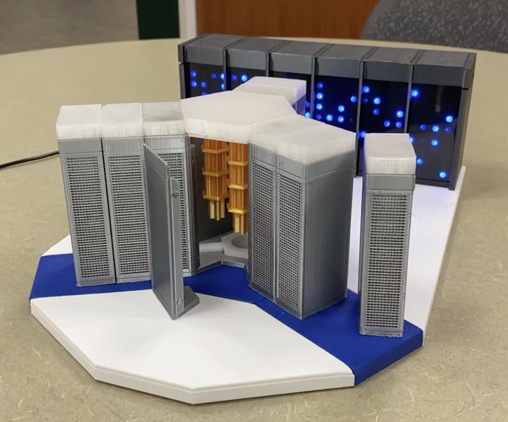
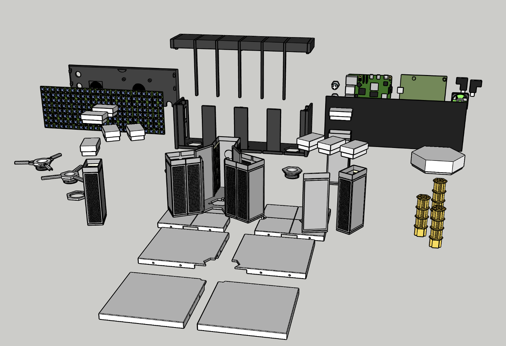

# RasQberry-Two-3Dmodel
3D model of IBM Quantum System Two, to build a functional model of IBM Quantum System Two aka "the RasQberry project".

The model captures the spirit of the System Two design, adhering closely to size ratios of the real physical system, with a little artistic license to produce a model that is
easy to print, assemble and "operate".

The essence of the marketing models used in promotional videos has been captured by fitting the the "Room Temperature Electronics" (RTE) boxes with magnets to give that 
satisfying "clunk" connection to the main cryostat structure.

Credit for the bulk of the 3D design work goes to [Eric Jenney](https://github.com/ejog), with significant input from [Andy Stanford-Clark](https://github.com/andysc),  [Sascha Shefenacker](https://github.com/saschaschefenacker), and [Jan Lahmann](https://github.com/JanLahmann) with ideas and testing input from a whole army of other enthusiastic contributors at IBM.

There are quite a lot of pieces, but they're easy to print, without the need for supports, and the process is [well-documented](https://rasqberry.org/3d-model/hardware-assembly-guide).

We hope you have as much fun building a model of the IBM Quantum System Two as we have had designing it! We very much welcome your feedback and suggestions for improvement.

